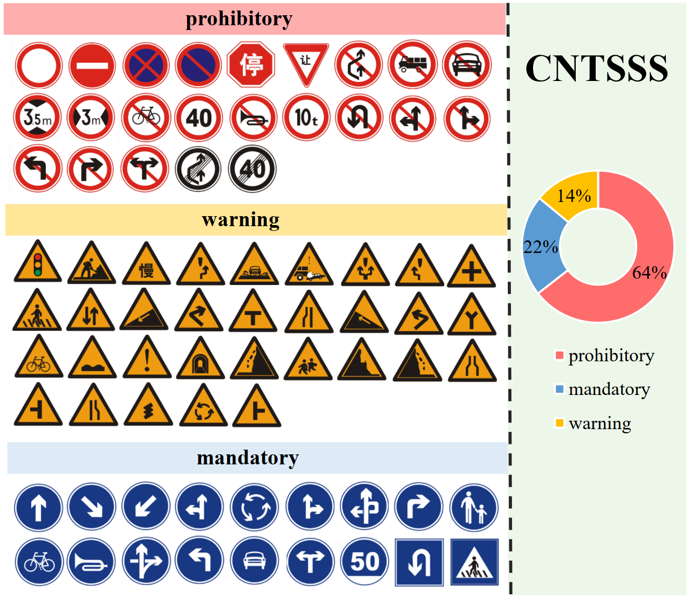
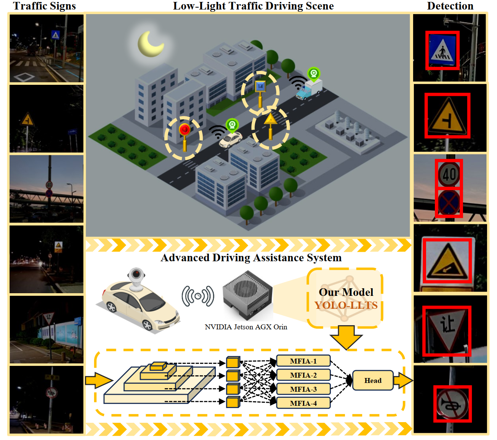
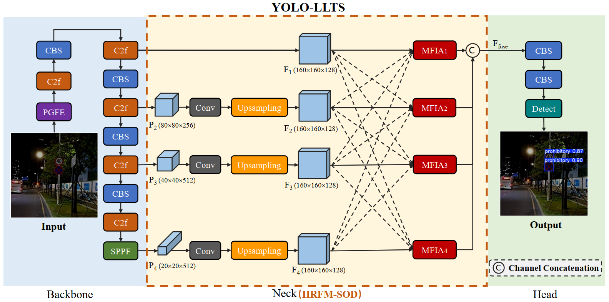
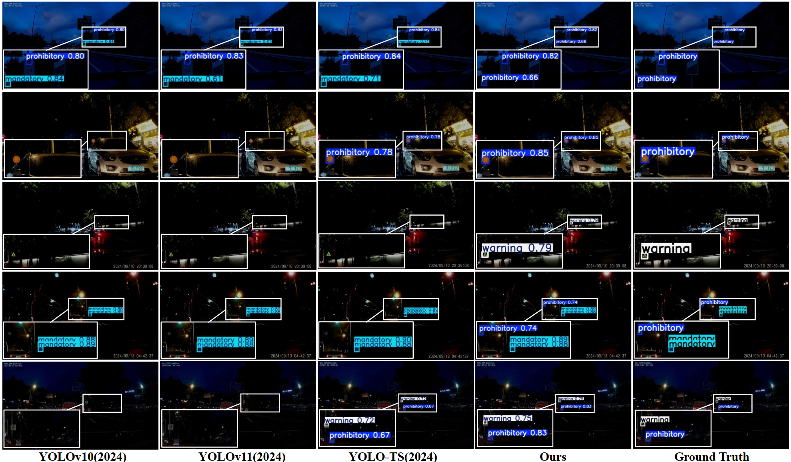

# YOLO-LLTS: Real-Time Low-Light Traffic Sign Detection via Prior-Guided Enhancement and Multi-Branch Feature Interaction

Ziyu Lin, Yunfan Wu, Yuhang Ma, Junzhou Chen, Ronghui Zhang, Jiaming Wu, Guodong Yin, Liang Lin

[Paper Download](https://arxiv.org/abs/2503.13883)

> **Abstract:** *Traffic sign detection is essential for autonomous driving and Advanced Driver Assistance Systems (ADAS). However, existing methods struggle with low-light conditions due to issues like indistinct small-object features, limited feature interaction, and poor image quality, which degrade detection accuracy and speed. To address this issue, we propose YOLO-LLTS, an end-to-end real-time traffic sign detection algorithm specifically designed for low-light environments. YOLO-LLTS introduces three main contributions: the High-Resolution Feature Map for Small Object Detection (HRFM-SOD) module to enhance small-object detection by mitigating feature dilution; the Multi-branch Feature Interaction Attention (MFIA) module to improve information extraction through multi-scale features interaction; and the Prior-Guided Feature Enhancement Module (PGFE) to enhance image quality by addressing noise, low contrast, and blurriness. Additionally, we construct a novel dataset, the Chinese Nighttime Traffic Sign Sample Set (CNTSSS), covering diverse nighttime scenarios. Experiments show that YOLO-LLTS achieves state-of-the-art performance, outperforming previous best methods by 2.7\% mAP50 and 1.6\% mAP50:95 on TT100K-night, 1.3\% mAP50 and 1.9\% mAP50:95 on CNTSSS, 7.5\% mAP50 and 9.8\% mAP50:95 on GTSDB-night, and superior results on CCTSDB2021. Deployment on edge devices confirms its real-time applicability and effectiveness.*

## Datasets
The CNTSSS dataset was collected across 17 cities in China, containing images captured under various nighttime lighting conditions ranging from dusk to deep night. It covers diverse scenarios, including urban, highway, and rural environments, as well as clear and rainy weather conditions.



* The download link for the dataset is below:

<table>
<tbody>
  <tr>
    <th>Google Drive</th>
    <th colspan="2"> <a href="https://drive.google.com/file/d/1A-7t-Wb5rjUZslUJ_1tltlUUvtSxBXdX/view?usp=drive_link">Download</a> </th>
  </tr>
   <tr>
    <th>Baidu Cloud</th>
    <th colspan="2"> <a href="https://pan.baidu.com/s/1dEtWBVt6UWAKkaOYBq3uDg">Download (Extraction code: dtrn)</a> </th>
  </tr>
</tbody>
</table>

* The file structure of the downloaded dataset is as follows.

```
CNTSSS
├── train
│   ├── images
│   ├── labels
├── test
│   ├── images
│   ├── labels
```

## Method

Application Scenarios of Traffic Sign Detection in advanced driver-assistance systems.


**YOLO-LLTS architecture.** Framework overview of our model YOLO-LLTS.

## code
### Requirements
* python 3.8
* torch 1.11.0
* torchvision 0.12.0
To install requirements: 
```
pip install -r requirements.txt
```

### Training
If you want to train the model:
```python
python train.py
```
### Testing
If you want to test the model:
```python
python test.py
```
Our trained weights for different datasets are listed in the "weight" folder.

## Experiment result


## Citation
If you use YOLO-LLTS or CNTSSS dataset, please consider citing:
```
@article{lin2025yolollts,
  title={YOLO-LLTS: Real-Time Low-Light Traffic Sign Detection via Prior-Guided Enhancement and Multi-Branch Feature Interaction},
  author={Lin, Ziyu and Wu, Yunfan and Ma, Yuhang and Chen, Junzhou and Zhang, Ronghui and Wu, Jiaming and Yin, Guodong and Lin, Liang},
  journal={arXiv preprint arXiv:2503.13883},
  year={2025}
}
```

## Contact
Should you have any question or suggestion, please contact linzy88@mail2.sysu.edu.cn
