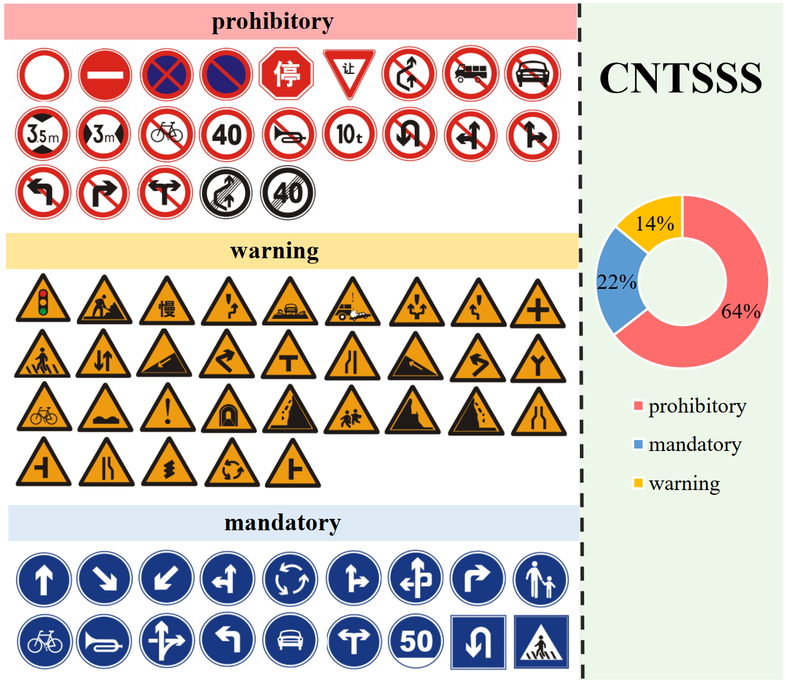
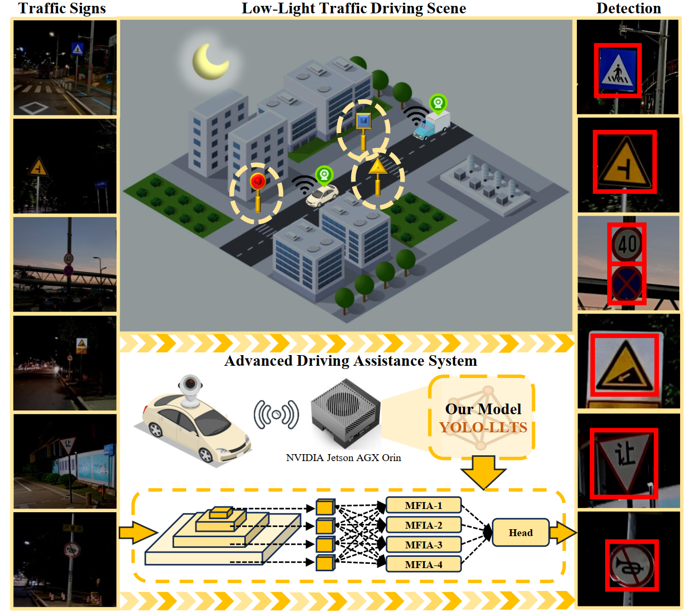
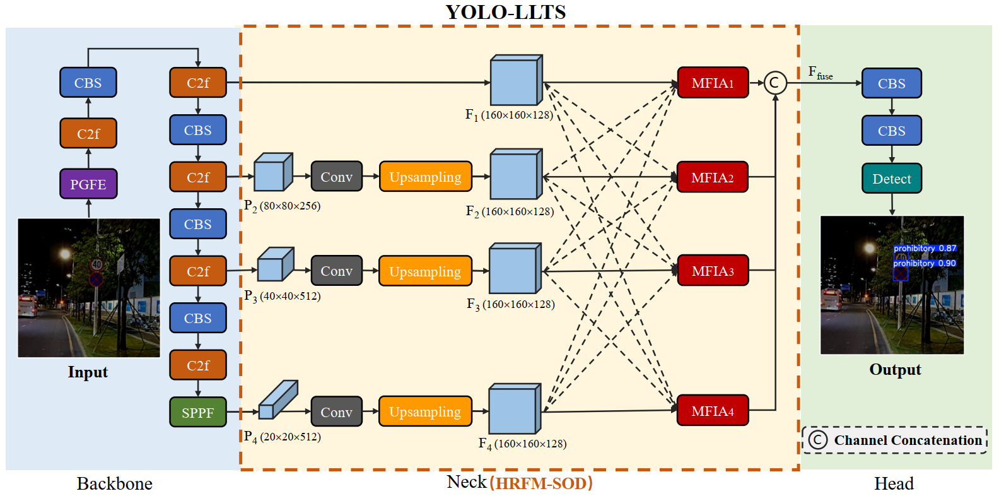
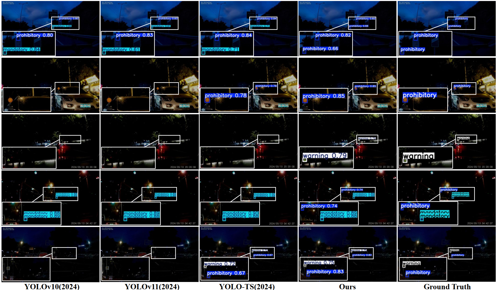

# YOLO-LLTS: Real-Time Low-Light Traffic Sign Detection via Prior-Guided Enhancement and Multi-Branch Feature Interaction

Ziyu Lin, Yunfan Wu, Yuhang Ma, Junzhou Chen, Ronghui Zhang, Jiaming Wu, Guodong Yin, Liang Lin

[Paper Download](https://ieeexplore.ieee.org/document/11146662)

> **Abstract:** *Traffic sign detection is essential for autonomous driving and Advanced Driver Assistance Systems (ADAS). However, existing methods struggle with low-light conditions due to issues like indistinct small-object features, limited feature interaction, and poor image quality, which degrade detection accuracy and speed. To address this issue, we propose YOLO-LLTS, an end-to-end real-time traffic sign detection algorithm specifically designed for low-light environments. YOLO-LLTS introduces three main contributions: the High-Resolution Feature Map for Small Object Detection (HRFM-SOD) module to enhance small-object detection by mitigating feature dilution; the Multi-branch Feature Interaction Attention (MFIA) module to improve information extraction through multi-scale features interaction; and the Prior-Guided Feature Enhancement Module (PGFE) to enhance image quality by addressing noise, low contrast, and blurriness. Additionally, we construct a novel dataset, the Chinese Nighttime Traffic Sign Sample Set (CNTSSS), covering diverse nighttime scenarios. Experiments show that YOLO-LLTS achieves state-of-the-art performance, outperforming previous best methods by 2.7\% mAP50 and 1.6\% mAP50:95 on TT100K-night, 1.3\% mAP50 and 1.9\% mAP50:95 on CNTSSS, 7.5\% mAP50 and 9.8\% mAP50:95 on GTSDB-night, and superior results on CCTSDB2021. Deployment on edge devices confirms its real-time applicability and effectiveness.*

## Datasets
The CNTSSS dataset was collected across 17 cities in China, containing images captured under various nighttime lighting conditions ranging from dusk to deep night. It covers diverse scenarios, including urban, highway, and rural environments, as well as clear and rainy weather conditions.



* The download link for the dataset is below:

<table>
<tbody>
  <tr>
    <th>Google Drive</th>
    <th colspan="2"> <a href="https://drive.google.com/file/d/1A-7t-Wb5rjUZslUJ_1tltlUUvtSxBXdX/view?usp=drive_link">Download</a> </th>
  </tr>
   <tr>
    <th>Baidu Cloud</th>
    <th colspan="2"> <a href="https://pan.baidu.com/s/1dEtWBVt6UWAKkaOYBq3uDg">Download</a> (Extraction code: dtrn)</th> 
  </tr>
</tbody>
</table>

* The file structure of the downloaded dataset is as follows.

```
CNTSSS
├── train
│   ├── images
│   ├── labels
├── test
│   ├── images
│   ├── labels
```

## Method

Application Scenarios of Traffic Sign Detection in advanced driver-assistance systems.


**YOLO-LLTS architecture.** Framework overview of our model YOLO-LLTS.

## 👐 Hands-On Guide
Use our YOLO-LLTS and CNTSSS Dataset in 6 Effortless Steps

### Step 1 — Requirements
* python 3.8
* torch 1.11.0
* torchvision 0.12.0

To install requirements: 
```
pip install -r requirements.txt
pip install opencv-python psutil tqdm timm einops
```

### Step 2 – Downloading the Dataset
The CNTSSS dataset can be downloaded using the link provided above, with two download methods: Google Drive and Baidu Cloud. The extraction code for Baidu Cloud is attached next to the link.

### Step 3 - Modifying the Dataset Configuration File

If you are using the CNTSSS dataset, you can directly use the provided cntsss.yaml. If you want to use a different dataset, you need to refer to cntsss.yaml and create your_dataset.yaml, including the dataset location and classification information.

### Step 4 - Training
If you want to train the model, you need to modify the dataset and parameter settings in train.py according to your task. Our model configuration is stored in the YOLO-LLTS.yaml file, and then:
```python
python train.py
```
### Step 5 - Testing
If you want to test the model, you need to replace it with the recently trained model in the test.py file, and then:
```python
python test.py
```

If you want the pre-trained models we have on different datasets, you can download them via the link below:

<table>
<tbody>
  <tr>
    <th>Google Drive</th>
    <th colspan="2"> <a href="https://drive.google.com/file/d/1put5JFC7hJZf-pK1O1O-LUY7B_XJQTT_/view?usp=drive_link">Download</a> </th>
  </tr>
   <tr>
    <th>Baidu Cloud</th>
    <th colspan="2"> <a href="https://pan.baidu.com/s/17iP5WHWGpP0jRugs_8XHrg">Download</a> (Extraction code: abfp)</th> 
  </tr>
</tbody>
</table>

### Step 6 - Detecting
If you want to use the trained weights to detect objects, modify the weights and dataset location in the detect.py file, and then:
```python
python detect.py
```

🎉 That’s all—train, test, and detect.


## Experiment result


## Citation
If you use YOLO-LLTS or CNTSSS dataset, please consider citing:
```
@ARTICLE{11146662,
  author={Lin, Ziyu and Wu, Yunfan and Ma, Yuhang and Chen, Junzhou and Zhang, Ronghui and Wu, Jiaming and Yin, Guodong and Lin, Liang},
  journal={IEEE Transactions on Instrumentation and Measurement}, 
  title={YOLO-LLTS: Real-Time Low-Light Traffic Sign Detection via Prior-Guided Enhancement and Multibranch Feature Interaction}, 
  year={2025},
  volume={74},
  number={},
  pages={1-18},
  keywords={Feature extraction;Object detection;Training;Lighting;Image enhancement;Real-time systems;Image edge detection;Data mining;Accuracy;Noise;Edge device deployment;end-to-end algorithm;low-light conditions;traffic sign dataset;traffic sign detection},
  doi={10.1109/TIM.2025.3604925}}
```

## Contact
Should you have any question or suggestion, please contact linzy88@mail2.sysu.edu.cn
